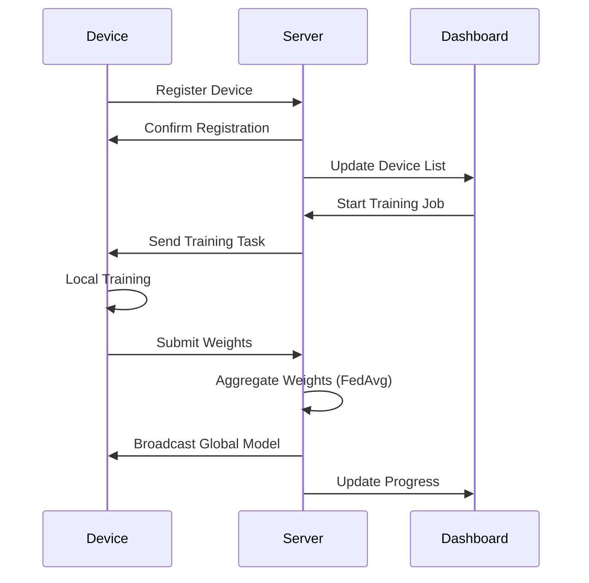

# NeuroFleet - Distributed Neural Network Training System

<div align="center">


**Train Neural Networks Across Your Entire Device Fleet**

[](https://nodejs.org/)
[](https://reactjs.org/)
[](https://flutter.dev/)
[](https://pytorch.org/)
[](LICENSE)

[Features](#-features) • [Quick Start](#-quick-start) • [Architecture](#-architecture) • [Documentation](#-documentation)

</div>

---

## 🌟 Overview

NeuroFleet is a **federated learning platform** that enables distributed neural network training across multiple devices. Connect your laptops, desktops, and mobile phones to collaboratively train machine learning models while keeping data locally on each device.

<div align="center">

```
┌────────────────────────────────────────────────────────────────┐
│                                                                │
│   📱 Mobile      💻 Laptop      🖥️ Desktop      📱 Tablet     │
│      │              │              │              │           │
│      └──────────────┴──────────────┴──────────────┘           │
│                          │                                     │
│                    ┌─────▼─────┐                               │
│                    │  Central  │                               │
│                    │  Server   │                               │
│                    └─────┬─────┘                               │
│                          │                                     │
│                    ┌─────▼─────┐                               │
│                    │   Web     │                               │
│                    │ Dashboard │                               │
│                    └───────────┘                               │
│                                                                │
└────────────────────────────────────────────────────────────────┘
```

</div>

## ✨ Features

### 🔌 Dynamic Device Management
- **Hot-plug support**: Connect/disconnect devices anytime
- **Automatic capability detection**: RAM, CPU, GPU, battery
- **Smart workload distribution**: Memory-aware batch sizes
- **Real-time health monitoring**: Heartbeat & resource tracking

### 🧠 Federated Learning
- **FedAvg Algorithm**: Weighted averaging of model updates
- **Secure aggregation**: Weights never leave the device raw
- **Gradient compression**: Efficient communication
- **Async training support**: Devices join/leave mid-round

### 📊 Stunning Dashboard
- **Glassmorphism UI**: Modern, professional design
- **Real-time updates**: Live training visualization
- **Device monitoring**: Status, resources, progress
- **Interactive charts**: Loss curves, accuracy trends

### 📱 Multi-Platform Clients
- **Python Client**: For laptops and desktops
- **Flutter App**: For iOS and Android devices
- **Browser Support**: WebSocket communication
- **Docker Support**: Easy deployment

## 🚀 Quick Start

### Prerequisites

- Node.js 18+
- Python 3.10+
- Docker & Docker Compose (optional)
- Flutter 3.0+ (for mobile app)

### One-Line Start

```bash
./scripts/start.sh
```

### Manual Setup

#### 1. Start the Server

```bash
cd distributed_server
npm install
npm run dev
```

#### 2. Start the Dashboard

```bash
cd web_dashboard
npm install
npm run dev
```

#### 3. Connect a Device

```bash
cd device_client
pip install -r requirements.txt
python src/client.py
```

### Docker Deployment

```bash
docker-compose -f docker-compose.distributed.yml up --build
```

## 🏗️ Architecture

```
trading_ml_system/
├── distributed_server/      # 🖥️ Central orchestration server
│   ├── src/
│   │   ├── server.js        # Express + Socket.io server
│   │   ├── socket/          # WebSocket handlers
│   │   └── services/        # Business logic
│   │       ├── deviceRegistry.js    # Device management
│   │       ├── jobScheduler.js      # Training coordination
│   │       ├── weightAggregator.js  # FedAvg implementation
│   │       └── metricsCollector.js  # Stats & monitoring
│   └── Dockerfile
│
├── web_dashboard/           # 🎨 React frontend
│   ├── src/
│   │   ├── pages/           # Dashboard, Devices, Training, Settings
│   │   ├── components/      # Reusable UI components
│   │   ├── hooks/           # Custom React hooks
│   │   └── services/        # API & Socket clients
│   └── Dockerfile
│
├── device_client/           # 🐍 Python client for desktops
│   └── src/
│       └── client.py        # Async client with PyTorch training
│
├── mobile_app/              # 📱 Flutter mobile app
│   └── lib/
│       ├── screens/         # App screens
│       ├── services/        # Socket, device, training services
│       └── widgets/         # Custom Flutter widgets
│
├── training_backend/        # 🧠 Original ML training code
│
├── docs/                    # 📚 Documentation
│
└── monitoring/              # 📈 Prometheus & Grafana configs
```

## 📚 Documentation

| Document | Description |
|----------|-------------|
| [Deployment Guide](docs/DEPLOYMENT.md) | Full deployment instructions |
| [API Reference](docs/API.md) | REST & WebSocket API docs |
| [Architecture](docs/ARCHITECTURE.md) | System design details |
| [Contributing](CONTRIBUTING.md) | Contribution guidelines |

## 🔧 Configuration

### Server Environment Variables

```env
PORT=3001
MONGODB_URI=mongodb://localhost:27017/distributed_training
REDIS_URL=redis://localhost:6379
JWT_SECRET=your-secret-key
MAX_DEVICES=100
HEARTBEAT_INTERVAL=30000
AGGREGATION_METHOD=fedavg
```

### Client Configuration

```python
client = DistributedClient(
    server_url="http://localhost:3001",
    device_name="My Laptop",
    max_batch_size=32
)
```

## 📊 Dashboard Preview

The dashboard provides:

- **📈 Training Progress**: Real-time loss and accuracy curves
- **🖥️ Device Overview**: Connected devices with status indicators
- **⚡ Resource Monitoring**: CPU, RAM, GPU utilization
- **🎛️ Training Control**: Start, stop, configure jobs
- **📋 Metrics History**: Historical training data

## 🔄 Training Flow



## 🛠️ Development

### Running Tests

```bash
# Server tests
cd distributed_server && npm test

# Dashboard tests
cd web_dashboard && npm test

# Python client tests
cd device_client && pytest
```

### Code Quality

```bash
# Lint server
cd distributed_server && npm run lint

# Lint dashboard
cd web_dashboard && npm run lint

# Format Python
cd device_client && black src/
```

## 📈 Performance Tips

| Device RAM | Recommended Batch Size |
|------------|----------------------|
| 2-4 GB     | 4-8                  |
| 4-8 GB     | 8-16                 |
| 8-16 GB    | 16-32                |
| 16+ GB     | 32-64                |

## 🤝 Contributing

We welcome contributions! Please see our [Contributing Guide](CONTRIBUTING.md) for details.

1. Fork the repository
2. Create your feature branch (`git checkout -b feature/amazing-feature`)
3. Commit your changes (`git commit -m 'Add amazing feature'`)
4. Push to the branch (`git push origin feature/amazing-feature`)
5. Open a Pull Request

## 📄 License

This project is licensed under the MIT License - see the [LICENSE](LICENSE) file for details.

## 🙏 Acknowledgments

- [PyTorch](https://pytorch.org/) for the amazing ML framework
- [Socket.io](https://socket.io/) for real-time communication
- [React](https://reactjs.org/) & [Tailwind CSS](https://tailwindcss.com/) for the beautiful UI
- [Flutter](https://flutter.dev/) for cross-platform mobile development

---

<div align="center">

**Built with ❤️ for distributed machine learning**

[⬆ Back to Top](#neurofleet---distributed-neural-network-training-system)

</div>
